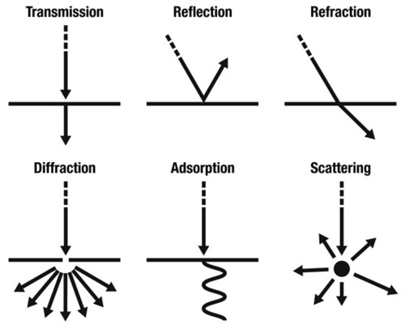

[< *Intro*](0.0.intro.md) | [**Summary**](0.0.intro.md#summary) | [*Superposition* >](1.2.superposition.md)

#
# Wave-particle duality

[Wave-like Behavior](#wave-like-behavior) |
[Particle-like Behavior](#particle-like-behavior) | 
[Complementarity](#complementarity) | 
[Experimental Evidence](#experimental-evidence)

## Wave-like Behavior

In classical physics, waves are described by continuous, oscillating disturbances that propagate through a medium or through empty space.

Waves exhibit characteristic properties such as interference, diffraction, and polarization.

In quantum mechanics, particles such as electrons, protons, and even atoms can exhibit wave-like behavior under certain conditions.

This wave-like behavior is described by a wavefunction, a mathematical function that represents the probability amplitude of finding the particle at different positions in space and time.

## Particle-like Behavior

In classical physics, particles are described as localized objects with definite positions and momenta.

Particles follow classical trajectories and interact with each other through collisions and other mechanical interactions.

In quantum mechanics, particles are described by wavefunctions that give the probability distribution of finding the particle at different locations.

When a measurement is made, the wavefunction collapses to a single state, and the particle is observed at a specific position with a certain probability.

## Complementarity

Wave-particle duality implies that particles can exhibit both wave-like and particle-like properties, depending on the experimental setup and the type of observation.

The behavior of particles as waves or particles is not deterministic but probabilistic, meaning that we can only predict the likelihood of finding a particle in a particular state.

This concept is often expressed as complementarity, which states that the wave and particle aspects of a quantum system are complementary and cannot be simultaneously observed with full precision.

## Experimental Evidence

The double-slit experiment is one of the most famous demonstrations of wave-particle duality. In this experiment, particles such as electrons or photons are fired at a barrier with two slits. When observed, they behave like particles, creating distinct impact patterns on a detector. However, when unobserved, they exhibit interference patterns characteristic of waves.

Other experiments, such as the photoelectric effect and electron diffraction, also provide evidence of wave-particle duality and the quantized nature of energy and momentum.

Overall, wave-particle duality is a central concept in quantum mechanics that challenges our classical intuition about the nature of matter and radiation. It underscores the probabilistic nature of quantum phenomena and highlights the interconnectedness of waves and particles at the microscopic scale.

#
[< *Intro*](0.0.intro.md) | [**Summary**](0.0.intro.md#summary) | [*Superposition* >](1.2.superposition.md)

